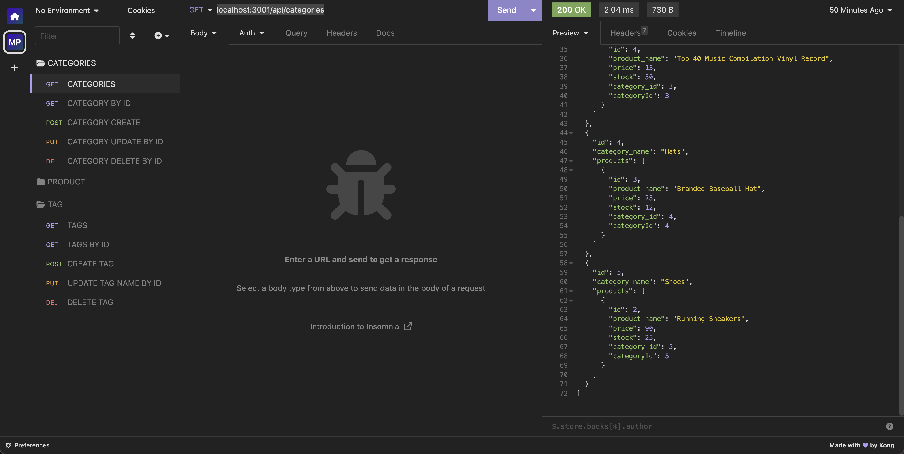
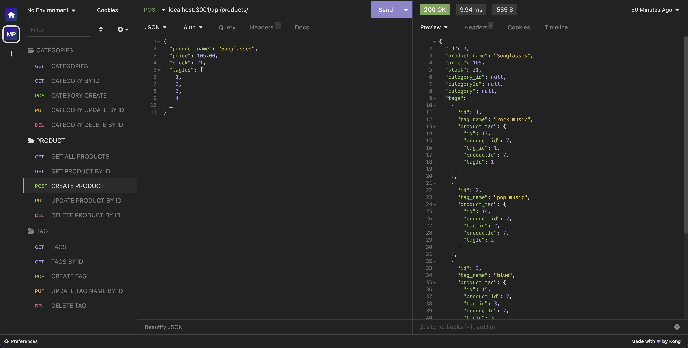

# SmartBuy Backend Code

## Description

This project is an implementation of a robust Express.js API that's been configured to interact with a MySQL database using Sequelize ORM. It's designed to simulate the essential functionality of an e-commerce platform's backend operations.

## Table Of Contents

- [Project Setup Guide](#project-setup-guide)
  - [Prerequisites](#prerequisites)
  - [Installation Steps](#installation-steps)
  - [Running the Application](#running-the-application)
  - [Interacting with the API](#interacting-with-the-api)
- [Links](#links)
- [Screenshots](#screenshots)
- [Technologies Used](#technologies-used)
- [Node Packages Used](#node-packages-used)
- [Contribution](#contribution)
- [License](#license)
- [Questions](#questions)

## Project Setup Guide

### Prerequisites

- Before proceeding, make sure you have the following software installed and configured on your machine:

- Node.js and NPM
MySQL Server and MySQL Workbench
A REST API client (Insomnia or Postman recommended)

### Installation Steps

1. Clone this repository to your local machine.

2. Navigate to the project directory Develop using your preferred terminal or command prompt.

3. Install the project dependencies by running npm install.

4. In your MySQL Workbench, create the database using the provided schema.sql file.

5. Seed the database with the command npm run seed.

### Running the Application

With all dependencies installed and the database set up, you can now start the server by running npm start in your terminal.

### Interacting with the API

Use your chosen REST API client to perform CRUD operations on the different endpoints provided by the application. Please refer to the route documentation for specific details on each endpoint.

## Links

SmartBuy Backend: [Demonstration Video Link](https://drive.google.com/file/d/1dPvx27Ng867yVwNyYO2lNWix0h2h6ori/view)

SmartBuy: [Github Repository](https://github.com/matthew-millard/smartbuy)

## Screenshots

## Technologies Used

- NodeJS

- MySQL

- MySQL Workbench

- Sequelize

- ExpressJS

- Insomnia REST API Client

- JavaScript

- VS Code

## Node Packages Used

- sequelize ^6.31.1

- express ^4.17.1

- dotenv ^16.0.3

- mysql2 ^3.3.2

## Contribution

You're welcome to contribute to this project in several ways: you can help identify and resolve bugs or suggest new features, review and suggest modifications to the code, or enhance the project's documentation. All of these contributions can be made through submitting pull requests.

## License

MIT License A short and simple permissive license with conditions only requiring preservation of copyright and license notices. Licensed works, modifications, and larger works may be distributed under different terms and without source code.

## Questions

If you have any questions related to this project, please don't hesitate to [email me](matthew.richie.millard@gmail.com).

If you would like to check out my other projects on Github: [matthew-millard](https://github.com/matthew-millard).